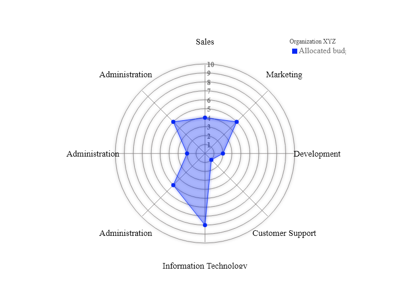

# Radar Chart


## Description

Radar Chart generator for Node.js (server-side) based on [D3.js](https://d3js.org/) v5.
This library contain supports to generate SVG, HTML and Image (png & jpeg) file.
  
## Install

Using NPM or YARN to install the package

```bash

npm install radarchart-node

```

```bash

yarn add radarchart-node

```
  
## Usage

```js

import { RadarChart } from 'radarchart-node';

const radarChart =  RadarChart(data, RadarOptions);

```

Check out the [test](./test) for usage.

### Output the visualization result to a image

```bash

npm run start

```

### Output Preview (png)



## API

### 1. RadarChart(data, [RadarOptions?], [SVGRadarOptions?])
  
#### Data* (required)

- Type: `Array<Object>`

- Example data structure

```javascript
const  data = [{
    name:  'Allocated budget',
    axes: [
        {axis:  'Sales', value:  4},
        {axis:  'Marketing', value:  5},
        {axis:  'Development', value:  2},
        {axis:  'Customer Support', value:  1},
        {axis:  'Information Technology', value:  8},
        {axis:  'Administration', value:  5},
        {axis:  'Administration', value:  2},
	{axis:  'Administration', value:  5}
    ],
    color:  '#26AF32'
}];
```

Each object data consists of the name, values array, and color.

#### RadarOptions (optional)

- Type: `Object`
- Example option structure  `RadarOptions`

```javascript
const  d3 =  require('d3-node')().d3;
const  cfg = {
    w:  450, // Width of the circle
    h:  350, // Height of the circle
    margin: {
        top:  10, right:  10, bottom:  10, left:  10
    }, // The margins of the SVG
    levels:  10, // How many levels or inner circles should there be drawn
    maxValue:  10, // What is the value that the biggest circle will represent
    strokeWidth:  1, // The width of the stroke around each blob
    roundStrokes: false, // If true the area and stroke will follow a round path (cardinal-closed)
    color:  d3.scaleOrdinal(d3.schemeCategory10), // Color function
    format:  '.0f', // Format default is .0f (%,...)
    unit:  '', // Unit value (ex: $...)
    legend: false // Format: { title: string, translateX: number, translateY: number }
};
```

!Note: Make sure you have install `d3-node` before running example

```bash

npm install d3-node

# or

yarn add d3-node

```

#### SVGRadarOptions (Optional)

- This option has been declared for the virtual DOM.  
- Default Object values for  for `SVGRadarOptions`

```javascript
const SVGOptions = {
    selector: ".radar-chart-node", // select class of container to create D3-canvas
    svgStyle: `
	.arc text {font: 10px sans-serif; text-anchor: middle;}
	.arc path {stroke: #fff;}
    `,
    container: `<div class="radar-chart-node"></div>`, // DOM contain the visualization result
    radius: 150
}
```

### 2. Generate SVG - HTML - Image (PNG || JPEG)

#### generateRadarChart(radarChartD3, [type?], [RadarGenerateOptions?])

- The function will convert the radar chart into `<SVGElement>` or `<HTMLElement>` and write it as a file by using option `write: true`
- Function`generateRadarChart` has 2 types: `svg` and `html`

```javascript
// import module
import { RadarChart, generateRadarChart } from 'radarchart-node'

const radarChartD3 = RadarChart(...) // object d3
const type = 'html' // default is 'svg'

// object by default
const RadarGenerateOptions = {
    write:  false, // set true if want to write as a file
    dest:  './test',
    fileName:  'radar-chart'
}

// generate chart
const generated = generateRadarChart(radarChartD3, type, RadarGenerateOptions)
console.log(generated) // -----> <!html>....<html>

```

#### generateRadarImage(radarChartD3, [type?], [RadarGenerateOptions?])

- The same as `generateRadarChart`, this function will generate radar chart as image and write it as `png` or `jpeg` image.
- Example of image generation:

```javascript
// import module
import { generateRadarImage} from 'radarchart-node'

const type = 'jpeg' // default is 'png'

// object by default
const RadarGenerateOptions = {
    dest:  './test',
    fileName:  'radar-chart'
}

// execute function to generate image
generateRadarImage(radarChartD3, type, RadarGenerateOptions)

```

## Contributing

1. Please submit your idea to this git branch if you have any suggestion!

2. Create feature branch: `git checkout -b new-feature`

3. Commit changes: `git commit -am 'New feature description'`

4. Then push: `git push origin new-feature`

5. Submit a pull request after accomplishing your new feature xD

## LICENSE

[MIT](LICENSE) LICENSE &copy; [d3-node](https://github.com/d3-node)
